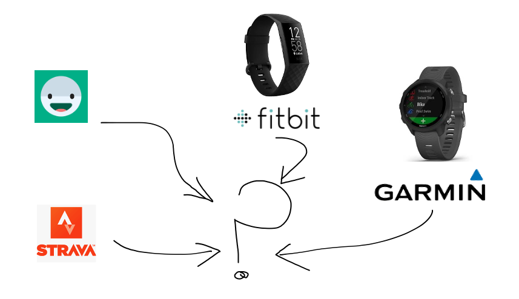
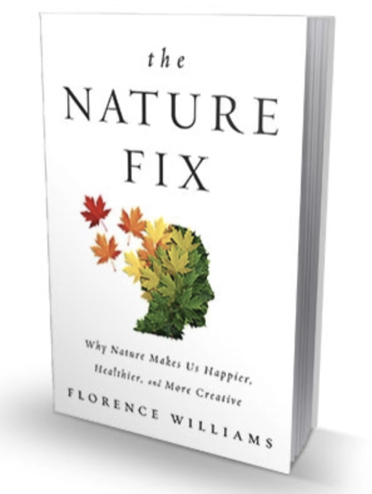
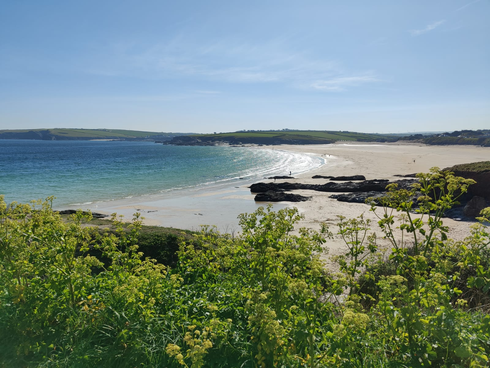
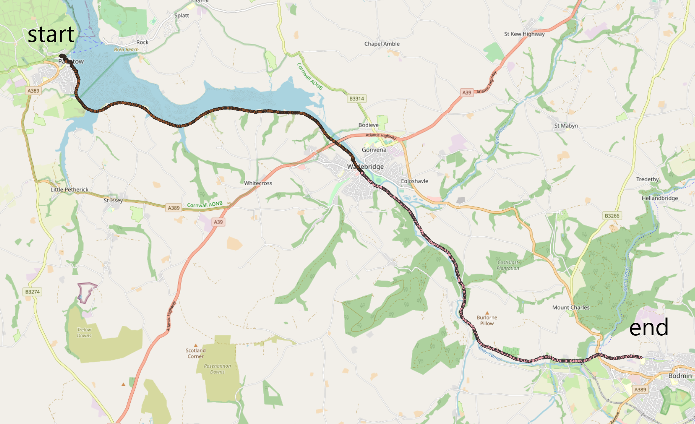

# Better Sleep, Please  - a data driven approach

## The challenge

## Further inspiration

## What have we done?

* Analyzed 8+ months of sleep data
* Tagged outdoor activities with geo-data

## Example activity: Cycling in Cornwall!

